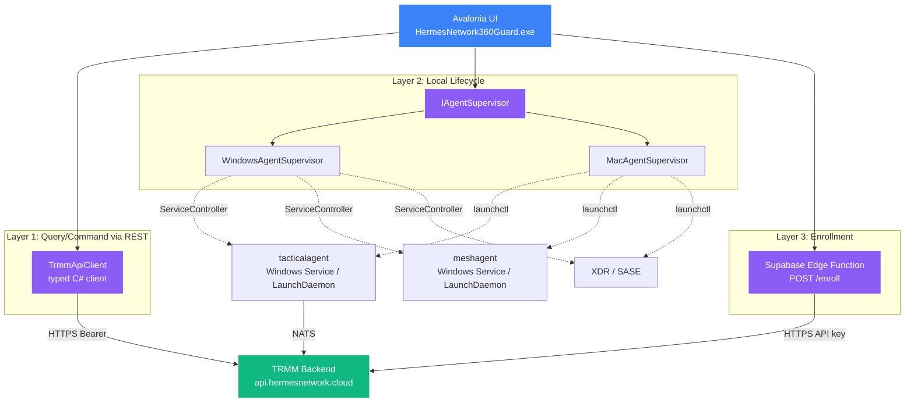
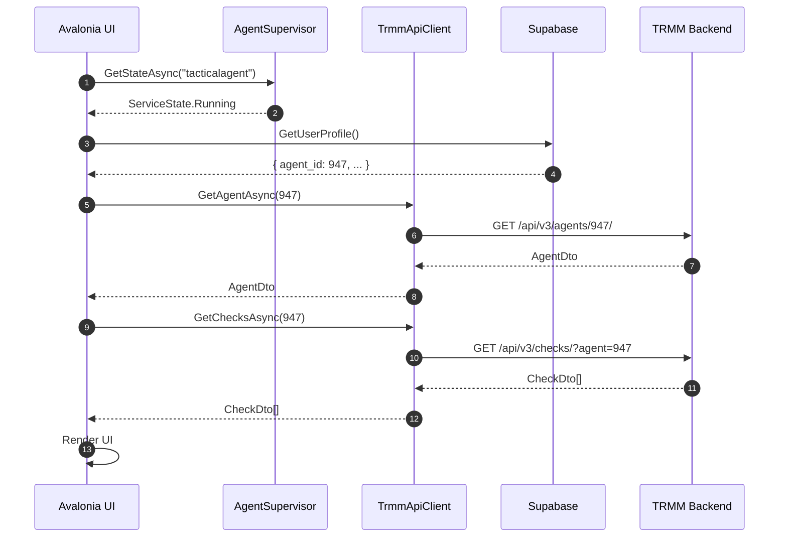
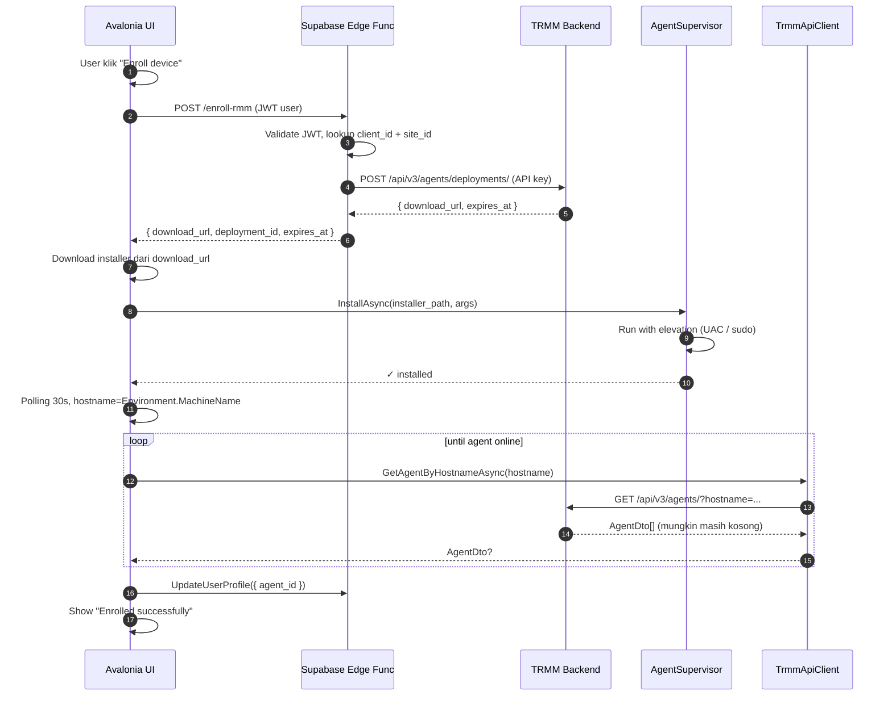

# 2. Arsitektur
{: .no_toc }

## Daftar Isi
{: .no_toc .text-delta }

1. TOC
{:toc}

---

## 2.1 Arsitektur saat ini (sebelum refactor)

```mermaid
flowchart TB
    UI[Avalonia UI<br/>HermesNetwork360Guard.exe]
    SE[ServiceEngine.exe<br/>Custom Windows Service]
    TRMM_AGENT[TRMM Agent<br/>tacticalagent.exe]
    MESH_AGENT[Mesh Agent]
    XDR[XDR Service]
    SASE[SASE / NGFW]

    TRMM_API[TRMM Backend<br/>api.hermesnetwork.cloud]
    SUPABASE[Supabase<br/>auth + config]

    UI -.JSON IPC.->|Code:DL2KNT, Z1398V...| SE
    SE -->|spawn process| TRMM_AGENT
    SE -->|spawn process| MESH_AGENT
    SE -->|spawn process| XDR
    SE -->|spawn process| SASE
    TRMM_AGENT -->|NATS + REST| TRMM_API
    UI -->|HTTPS auth| SUPABASE

    style UI fill:#3b82f6,stroke:#fff,color:#fff
    style SE fill:#dc2626,stroke:#fff,color:#fff
    style TRMM_API fill:#10b981,stroke:#fff,color:#fff
```

**Karakteristik:**

- UI hanya tahu *kode IPC*, bukan domain object
- ServiceEngine adalah blackbox yang melakukan terlalu banyak hal
- State queries dan lifecycle commands lewat protocol yang sama
- Coupling tinggi: ganti satu hal, banyak yang break

## 2.2 Arsitektur baru (target)



**Karakteristik:**

- **Tiga lapis yang independen**, bisa di-test terpisah
- Tidak ada custom IPC. Komunikasi pakai HTTP standar atau OS API.
- ServiceEngine.exe **dihilangkan** di akhir migrasi (lihat [Bab 10]())
- TRMM API adalah single source of truth untuk state agent
- Enrollment lewat backend Supabase, bukan di-hardcode di client

## 2.3 Tiga lapis: tanggung jawab

### Layer 1 — `TrmmApiClient`

**Tanggung jawab:** Semua interaksi **read** dan **command** ke TRMM backend.

| Yang dilakukan | Yang TIDAK dilakukan |
|---|---|
| GET agent status, checks, scripts | Mengelola process lokal |
| POST run script, send alert ack | Menyimpan state lokal |
| POST create deployment URL | Authentication user (itu Supabase) |
| WebSocket subscribe agent events | Logging file lokal |

**Lokasi rekomendasi di repo:**
```
HermesNetwork/
└── Trmm/
    ├── TrmmApiClient.cs           ← class utama
    ├── Models/
    │   ├── AgentDto.cs
    │   ├── DeploymentDto.cs
    │   ├── ScriptDto.cs
    │   └── ...
    └── Exceptions/
        └── TrmmApiException.cs
```

Detail di [Bab 4 — TrmmApiClient]().

### Layer 2 — `AgentSupervisor`

**Tanggung jawab:** Lifecycle service lokal di OS endpoint.

| Yang dilakukan | Yang TIDAK dilakukan |
|---|---|
| Start / Stop service | Tahu detail TRMM API |
| Install / Uninstall agent | Logging server-side |
| Query service state (Running/Stopped) | Manage user account |
| Elevate privilege saat install | Authentication |

**Lokasi rekomendasi:**
```
HermesNetwork/
└── Supervisor/
    ├── IAgentSupervisor.cs
    ├── ServiceState.cs
    ├── Windows/
    │   └── WindowsAgentSupervisor.cs
    └── Mac/
        └── MacAgentSupervisor.cs
```

Detail di [Bab 5 — AgentSupervisor]().

### Layer 3 — Enrollment Flow

**Tanggung jawab:** Mendaftarkan endpoint baru ke TRMM, mengasosiasikannya dengan user/tenant.

Komponen:

1. **Supabase Edge Function** `POST /functions/v1/enroll-rmm`
   - Memvalidasi JWT user
   - Memanggil TRMM `/api/v3/agents/deployments/` dengan API key server-side
   - Mengembalikan one-time deployment URL ke desktop client
2. **Desktop client**
   - Memanggil edge function dengan JWT user
   - Download installer (MSI / PKG) dari deployment URL
   - Run installer via `AgentSupervisor.InstallAsync(...)`
   - Polling `TrmmApiClient.GetAgentByHostnameAsync(...)` sampai agent online
   - Menyimpan `agent_id` di Supabase user profile

Detail di [Bab 6 — Enrollment Flow]().

## 2.4 Aliran data: contoh "user buka tab RMM"

Skenario: user login, klik tab "RMM Status" untuk melihat apakah agent terinstall, online, dan tampilkan check terakhir.



**Catatan:**

- UI hanya panggil tiga komponen: `AgentSupervisor`, `Supabase`, `TrmmApiClient` — semua punya kontrak yang jelas
- Tidak ada IPC custom, tidak ada `Code:"..."` magic
- Setiap layer bisa di-mock untuk unit test UI

## 2.5 Aliran data: contoh "user enroll device baru"



**Karakteristik:**

- Token deployment **tidak pernah ada di client desktop** — hanya download URL satu kali pakai
- API key TRMM **tidak pernah di-embed di client** — hanya ada di Supabase Edge Function
- Re-enroll = call ulang `POST /enroll-rmm` — TRMM cleanup otomatis kalau hostname sama

## 2.6 Trade-off & rationale

| Keputusan | Alternatif yang ditolak | Alasan |
|-----------|-------------------------|--------|
| Pakai TRMM REST API langsung dari client | Pakai gRPC custom di backend | TRMM sudah punya REST yang lengkap. Reinvent = tech debt |
| Supabase Edge Function sebagai proxy enrollment | Embed API key di client | Embed = compromise client = compromise key. Edge function = key di server only |
| `IAgentSupervisor` cross-platform | Dua kelas terpisah Windows/Mac di UI | Interface = UI tidak peduli OS. Testable. |
| Hapus ServiceEngine.exe | Pertahankan ServiceEngine + tambah lapisan | Surface area kecil = audit gampang. ServiceEngine tidak bring value setelah refactor. |
| State dari TRMM API, bukan lokal | Cache lokal di SQLite | TRMM = source of truth. Cache lokal = drift risk. UI bisa polling 30s atau pakai WebSocket. |

## 2.7 Apa yang TIDAK berubah

Sengaja dibatasi scope agar bisa migrasi inkremental:

- ✅ Tab/screen UI Avalonia — tetap struktur sekarang
- ✅ Avalonia themes / branding
- ✅ Login flow (Supabase + TFA)
- ✅ Logging file lokal (`HelpReport.cs`)
- ✅ Update mechanism aplikasi
- ✅ Supabase schema / table struktur (kecuali tambah kolom `trmm_agent_id`)

## 2.8 Apa yang berubah

- ❌ `IpcComService.cs` — DIHAPUS di akhir migrasi
- ❌ `ServiceEngineUtils.cs` magic-string handling — DIHAPUS
- ❌ `ServiceEngine.exe` Windows Service — DIHAPUS
- ➕ `HermesNetwork/Trmm/` — namespace baru
- ➕ `HermesNetwork/Supervisor/` — namespace baru
- ➕ Supabase Edge Function `enroll-rmm` — komponen baru
- 🔄 `XdrRestApi.cs` — pertahankan, tapi panggilannya tidak lagi via IPC
- 🔄 Lifecycle agent jadi langsung `ServiceController` / `launchctl`

---

[← Bab 1 Pendahuluan](){: .btn }
[Bab 3 — Prasyarat →](){: .btn .btn-primary }
