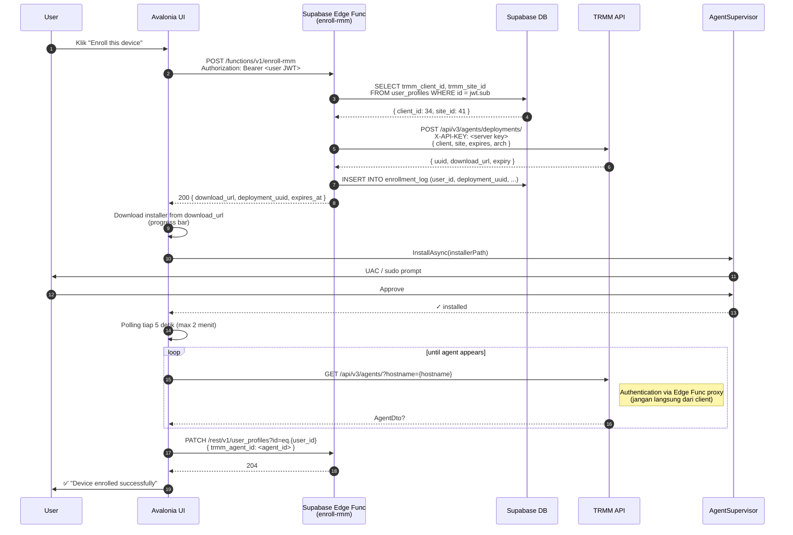

# 6. Layer 3 — Enrollment Flow
{: .no_toc }

## Daftar Isi
{: .no_toc .text-delta }

1. TOC
{:toc}

---

## 6.1 Tujuan

Enrollment = proses mendaftarkan endpoint baru ke TRMM, mengasosiasikan dengan user/tenant yang tepat. Yang berbeda dari pendekatan saat ini:

| Aspek | Sekarang (lama) | Target (baru) |
|---|---|---|
| API key TRMM | Embed di payload IPC desktop | Hanya di Supabase Edge Function (server-side) |
| Token enrollment | Long-lived, hardcoded | One-time, expire 24 jam |
| Multi-tenant | Hardcoded `user_369`, `org_34` | Lookup berdasarkan user JWT |
| Re-enroll | Manual cleanup registry/file | Otomatis: panggil endpoint lagi |
| Audit trail | Tidak ada | Tercatat di TRMM + Supabase |

## 6.2 Sequence diagram



> **Catatan keamanan:** langkah 11 (polling agent dari client) idealnya juga lewat edge function proxy — bukan call langsung ke TRMM dari client. Detail di [Bab 7]({{ site.baseurl }}).

## 6.3 Supabase schema

Tambahkan kolom di tabel `user_profiles`:

```sql
ALTER TABLE user_profiles
  ADD COLUMN IF NOT EXISTS trmm_client_id INTEGER,
  ADD COLUMN IF NOT EXISTS trmm_site_id   INTEGER,
  ADD COLUMN IF NOT EXISTS trmm_agent_id  INTEGER;

CREATE INDEX IF NOT EXISTS idx_user_profiles_trmm_agent
  ON user_profiles (trmm_agent_id);
```

Tabel audit untuk enrollment:

```sql
CREATE TABLE IF NOT EXISTS enrollment_log (
    id              BIGSERIAL PRIMARY KEY,
    user_id         UUID NOT NULL REFERENCES auth.users(id),
    deployment_uuid TEXT NOT NULL,
    client_id       INTEGER NOT NULL,
    site_id         INTEGER NOT NULL,
    hostname        TEXT,
    platform        TEXT,
    requested_at    TIMESTAMPTZ NOT NULL DEFAULT NOW(),
    completed_at    TIMESTAMPTZ,
    agent_id        INTEGER,
    status          TEXT NOT NULL DEFAULT 'pending'   -- 'pending' | 'completed' | 'expired' | 'failed'
);

CREATE INDEX idx_enrollment_log_user ON enrollment_log (user_id, requested_at DESC);
CREATE INDEX idx_enrollment_log_uuid ON enrollment_log (deployment_uuid);

-- RLS: user hanya bisa lihat enrollment-nya sendiri
ALTER TABLE enrollment_log ENABLE ROW LEVEL SECURITY;

CREATE POLICY "users_own_enrollments" ON enrollment_log
  FOR SELECT USING (auth.uid() = user_id);
```

## 6.4 Supabase Edge Function: `enroll-rmm`

### 6.4.1 Buat function

```bash
cd <your-supabase-project>
supabase functions new enroll-rmm
```

### 6.4.2 File `supabase/functions/enroll-rmm/index.ts`

```typescript
import { serve } from "https://deno.land/std@0.224.0/http/server.ts";
import { createClient } from "https://esm.sh/@supabase/supabase-js@2.46.1";

const TRMM_API_URL    = Deno.env.get("TRMM_API_URL")!;
const TRMM_API_KEY    = Deno.env.get("TRMM_API_KEY")!;
const SUPABASE_URL    = Deno.env.get("SUPABASE_URL")!;
const SERVICE_ROLE    = Deno.env.get("SUPABASE_SERVICE_ROLE_KEY")!;

interface EnrollRequest {
  hostname: string;
  platform: "windows" | "darwin" | "linux";
  arch?: "amd64" | "arm64" | "amd64-mac";
}

interface DeploymentResponse {
  download_url: string;
  deployment_uuid: string;
  expires_at: string;
}

serve(async (req: Request): Promise<Response> => {
  if (req.method === "OPTIONS") {
    return new Response(null, { headers: corsHeaders() });
  }
  if (req.method !== "POST") {
    return jsonError(405, "Method not allowed");
  }

  // 1. Validate user JWT
  const authHeader = req.headers.get("Authorization") || "";
  if (!authHeader.startsWith("Bearer ")) {
    return jsonError(401, "Missing Bearer token");
  }
  const userJwt = authHeader.slice(7);

  const supabaseUser = createClient(SUPABASE_URL, SERVICE_ROLE, {
    global: { headers: { Authorization: `Bearer ${userJwt}` } },
  });
  const { data: userData, error: userErr } = await supabaseUser.auth.getUser();
  if (userErr || !userData.user) {
    return jsonError(401, "Invalid user token");
  }
  const userId = userData.user.id;

  // 2. Lookup user's TRMM tenant mapping
  const supabaseAdmin = createClient(SUPABASE_URL, SERVICE_ROLE);
  const { data: profile, error: profileErr } = await supabaseAdmin
    .from("user_profiles")
    .select("trmm_client_id, trmm_site_id")
    .eq("id", userId)
    .single();

  if (profileErr || !profile) {
    return jsonError(404, "User profile not found");
  }
  const clientId = profile.trmm_client_id ?? Number(Deno.env.get("TRMM_DEFAULT_CLIENT_ID")!);
  const siteId   = profile.trmm_site_id   ?? Number(Deno.env.get("TRMM_DEFAULT_SITE_ID")!);

  // 3. Parse body
  let body: EnrollRequest;
  try { body = await req.json(); }
  catch { return jsonError(400, "Invalid JSON body"); }

  if (!body.hostname || !body.platform) {
    return jsonError(400, "hostname and platform are required");
  }

  const arch = body.arch ?? defaultArchFor(body.platform);

  // 4. Request deployment URL from TRMM
  const expires = new Date(Date.now() + 24 * 60 * 60 * 1000);
  const deployResp = await fetch(`${TRMM_API_URL}/api/v3/agents/deployments/`, {
    method: "POST",
    headers: {
      "X-API-KEY": TRMM_API_KEY,
      "Content-Type": "application/json",
    },
    body: JSON.stringify({
      client:  clientId,
      site:    siteId,
      expires: expires.toISOString(),
      arch:    arch,
    }),
  });

  if (!deployResp.ok) {
    const text = await deployResp.text();
    console.error("TRMM deployment failed:", deployResp.status, text);
    return jsonError(502, "Failed to create TRMM deployment");
  }

  const deployment = await deployResp.json();

  // 5. Audit log
  await supabaseAdmin.from("enrollment_log").insert({
    user_id:         userId,
    deployment_uuid: deployment.uuid,
    client_id:       clientId,
    site_id:         siteId,
    hostname:        body.hostname,
    platform:        body.platform,
    status:          "pending",
  });

  // 6. Respond to client
  const response: DeploymentResponse = {
    download_url:    deployment.download_url,
    deployment_uuid: deployment.uuid,
    expires_at:      expires.toISOString(),
  };
  return new Response(JSON.stringify(response), {
    status: 200,
    headers: { ...corsHeaders(), "Content-Type": "application/json" },
  });
});

function defaultArchFor(platform: string): string {
  if (platform === "windows") return "amd64";
  if (platform === "darwin")  return "amd64-mac";
  return "amd64";
}

function jsonError(status: number, message: string): Response {
  return new Response(JSON.stringify({ error: message }), {
    status,
    headers: { ...corsHeaders(), "Content-Type": "application/json" },
  });
}

function corsHeaders(): HeadersInit {
  return {
    "Access-Control-Allow-Origin":  "*",
    "Access-Control-Allow-Headers": "authorization, x-client-info, apikey, content-type",
    "Access-Control-Allow-Methods": "POST, OPTIONS",
  };
}
```

### 6.4.3 Deploy

```bash
# Set secrets (sekali saja)
supabase secrets set TRMM_API_URL=https://api.hermesnetwork.cloud
supabase secrets set TRMM_API_KEY=your-api-key-here
supabase secrets set TRMM_DEFAULT_CLIENT_ID=34
supabase secrets set TRMM_DEFAULT_SITE_ID=41

# Deploy function
supabase functions deploy enroll-rmm

# Test
curl -X POST https://YOUR_PROJECT.supabase.co/functions/v1/enroll-rmm \
  -H "Authorization: Bearer USER_JWT_HERE" \
  -H "Content-Type: application/json" \
  -d '{"hostname":"TEST-PC","platform":"windows"}'
```

Expected response:

```json
{
  "download_url":    "https://api.hermesnetwork.cloud/api/v3/agents/deployments/abc-uuid/download/",
  "deployment_uuid": "abc-uuid",
  "expires_at":      "2026-04-22T10:30:00.000Z"
}
```

## 6.5 Desktop client integration

### 6.5.1 `EnrollmentService.cs`

```csharp
using System;
using System.IO;
using System.Net.Http;
using System.Net.Http.Json;
using System.Text.Json.Serialization;
using System.Threading;
using System.Threading.Tasks;
using HermesNetwork.Supervisor;
using HermesNetwork.Trmm;

namespace HermesNetwork.Enrollment;

public sealed class EnrollmentService
{
    private readonly HttpClient _http;
    private readonly IAgentSupervisor _supervisor;
    private readonly ITrmmApiClient _trmm;
    private readonly Func<string> _userJwtProvider;     // ambil JWT dari Supabase session

    public EnrollmentService(
        HttpClient http,
        IAgentSupervisor supervisor,
        ITrmmApiClient trmm,
        Func<string> userJwtProvider)
    {
        _http        = http;
        _supervisor  = supervisor;
        _trmm        = trmm;
        _userJwtProvider = userJwtProvider;
    }

    public async Task<EnrollmentResult> EnrollAsync(
        string supabaseUrl, CancellationToken ct = default)
    {
        var hostname = Environment.MachineName;
        var platform = OperatingSystem.IsWindows() ? "windows"
                     : OperatingSystem.IsMacOS()   ? "darwin"
                     : throw new PlatformNotSupportedException();

        // 1. Request deployment URL
        var jwt = _userJwtProvider();
        var req = new HttpRequestMessage(HttpMethod.Post,
            $"{supabaseUrl}/functions/v1/enroll-rmm")
        {
            Content = JsonContent.Create(new { hostname, platform })
        };
        req.Headers.Add("Authorization", $"Bearer {jwt}");

        using var resp = await _http.SendAsync(req, ct);
        resp.EnsureSuccessStatusCode();
        var deployment = await resp.Content.ReadFromJsonAsync<DeploymentResponse>(cancellationToken: ct);
        if (deployment is null)
            throw new InvalidOperationException("Empty deployment response");

        // 2. Download installer
        var installerPath = await DownloadInstallerAsync(deployment.DownloadUrl, ct);

        // 3. Install
        await _supervisor.InstallAsync(new InstallRequest(
            InstallerPath:    installerPath,
            Arguments:        "",
            RequiresElevation: true,
            TimeoutSeconds:    300), ct);

        // 4. Polling sampai agent online
        var deadline = DateTime.UtcNow.AddMinutes(2);
        while (DateTime.UtcNow < deadline)
        {
            ct.ThrowIfCancellationRequested();
            var agent = await _trmm.GetAgentByHostnameAsync(hostname, ct);
            if (agent is not null)
            {
                return new EnrollmentResult(
                    AgentId:   agent.AgentId,
                    Hostname:  agent.Hostname,
                    Platform:  agent.Platform);
            }
            await Task.Delay(5_000, ct);
        }

        throw new TimeoutException("Agent did not appear in TRMM within 2 minutes");
    }

    private async Task<string> DownloadInstallerAsync(string url, CancellationToken ct)
    {
        var ext = OperatingSystem.IsWindows() ? ".exe" : ".pkg";
        var path = Path.Combine(Path.GetTempPath(),
            $"trmm-deploy-{Guid.NewGuid():N}{ext}");

        using var resp = await _http.GetAsync(url, HttpCompletionOption.ResponseHeadersRead, ct);
        resp.EnsureSuccessStatusCode();

        await using var fs = File.Create(path);
        await resp.Content.CopyToAsync(fs, ct);

        return path;
    }

    private sealed record DeploymentResponse(
        [property: JsonPropertyName("download_url")]    string DownloadUrl,
        [property: JsonPropertyName("deployment_uuid")] string Uuid,
        [property: JsonPropertyName("expires_at")]      DateTimeOffset ExpiresAt);
}

public sealed record EnrollmentResult(
    string AgentId,
    string Hostname,
    string Platform);
```

### 6.5.2 Penggunaan dari ViewModel

```csharp
public sealed class DeviceEnrollmentViewModel : ViewModelBase
{
    private readonly EnrollmentService _enroll;
    private readonly ISupabaseClient _supabase;     // wrapper di Hermes
    private readonly ILogger<DeviceEnrollmentViewModel> _log;

    [ObservableProperty] private string _state = "idle";
    [ObservableProperty] private string? _error;

    [RelayCommand]
    public async Task EnrollDeviceAsync(CancellationToken ct = default)
    {
        try
        {
            State = "Requesting deployment URL...";
            var result = await _enroll.EnrollAsync(_supabase.Url, ct);

            State = "Saving agent info...";
            await _supabase.UpdateProfileAsync(new
            {
                trmm_agent_id = int.Parse(result.AgentId)
            });

            State = $"Enrolled as {result.Hostname} ({result.AgentId})";
        }
        catch (Exception ex)
        {
            _log.LogError(ex, "Enrollment failed");
            State = "failed";
            Error = ex.Message;
        }
    }
}
```

## 6.6 Edge cases

### 6.6.1 Re-enrollment (sudah pernah enrolled)

Kalau user sudah pernah enroll dan klik enroll lagi:

1. TRMM akan deteksi hostname yang sama
2. Generate deployment baru tetap bekerja — installer akan **overwrite** agent lama
3. `agent_id` di TRMM tetap sama (TRMM tidak duplicate)
4. Polling step (4) akan langsung sukses karena hostname sudah ada

Tidak perlu special-case di code.

### 6.6.2 Enrollment timeout

Kalau setelah 2 menit agent belum muncul:

- Kemungkinan: installer gagal silent, firewall block agent ke api.hermesnetwork.cloud, atau service belum start
- Tampilkan instruksi troubleshooting ke user (lihat [Bab 11]({{ site.baseurl }}))
- **Jangan** auto-retry tanpa input user — bisa generate banyak deployment yang expire

### 6.6.3 User tutup app saat installer jalan

Installer di Windows MSI biasanya jalan di process terpisah (msiexec.exe), jadi UI bisa close tanpa abort install. Tapi:

- Polling step (4) akan terhenti
- User harus klik enroll lagi untuk verify (kasus 6.6.1)

### 6.6.4 Deployment URL expired

24 jam dari `expires_at`. Kalau user tidak install dalam window itu:

- Download akan return 404 / 410
- UI catch exception, tampilkan "Deployment expired, please retry"
- Klik enroll lagi → buat deployment baru

## 6.7 Testing

### 6.7.1 Test edge function di Supabase

```bash
# Get a real user JWT (login via Supabase)
JWT=$(curl -X POST https://YOUR_PROJECT.supabase.co/auth/v1/token?grant_type=password \
  -H "apikey: YOUR_ANON_KEY" \
  -H "Content-Type: application/json" \
  -d '{"email":"test@hermes.net","password":"..."}' | jq -r .access_token)

curl -X POST https://YOUR_PROJECT.supabase.co/functions/v1/enroll-rmm \
  -H "Authorization: Bearer $JWT" \
  -H "Content-Type: application/json" \
  -d '{"hostname":"TEST-PC","platform":"windows"}'
```

### 6.7.2 End-to-end test di VM bersih

1. Spin up VM baru (Windows 10 atau Ventura)
2. Install desktop app dari MSI/PKG terbaru
3. Login dengan akun test
4. Klik "Enroll device"
5. Approve UAC / sudo
6. Verifikasi di `https://rmm.hermesnetwork.cloud` — agent muncul di list

### 6.7.3 Negative tests

- [ ] Edge function return 401 kalau JWT invalid
- [ ] Edge function return 404 kalau user belum punya `trmm_client_id`
- [ ] Edge function return 502 kalau TRMM API down
- [ ] Desktop client tampilkan error friendly, bukan stack trace, kalau install gagal
- [ ] Polling timeout tidak crash app

---

[← Bab 5 AgentSupervisor]({{ site.baseurl }}){: .btn }
[Bab 7 — Auth & Keamanan →]({{ site.baseurl }}){: .btn .btn-primary }
