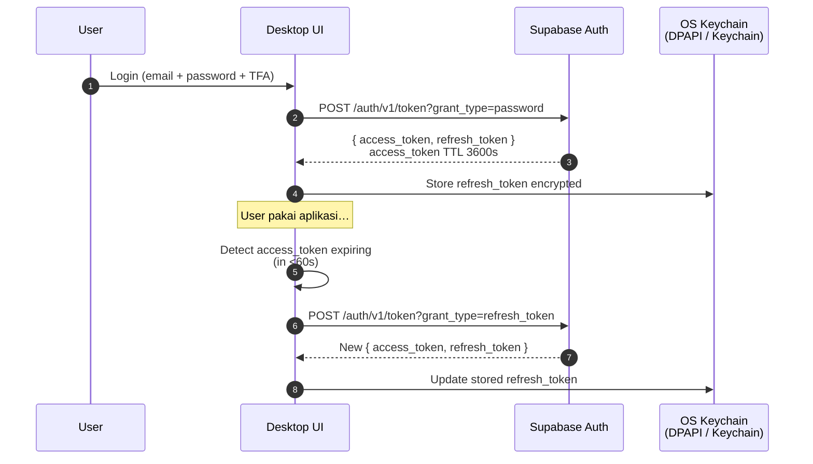

# 7. Authentication & Keamanan
{: .no_toc }

## Daftar Isi
{: .no_toc .text-delta }

1. TOC
{:toc}

---

## 7.1 Prinsip dasar

Tiga aturan emas:

1. **API key TRMM tidak boleh embed di desktop client.**
   Client adalah binary terdistribusi yang bisa di-reverse engineer. Apa pun yang ada di sana harus dianggap public.
2. **Setiap call dari client harus carry user JWT.**
   JWT membatasi RBAC dan audit trail. Client tanpa user yang login tidak boleh punya privilege apa pun ke TRMM.
3. **Edge function adalah trust boundary.**
   Edge function di Supabase memegang TRMM API key dan menerapkan RBAC: user X cuma bisa lihat agent miliknya, tidak bisa lihat agent user lain.

## 7.2 Threat model

| Threat | Defended? | Mitigasi |
|---|---|---|
| Reverse-engineer desktop binary → ekstrak API key | ✅ | API key tidak ada di binary; hanya pub-key log encryption ada |
| Steal user JWT dari memory desktop | ⚠️ Partial | JWT TTL pendek (1 jam), refresh token rotated |
| MITM antara desktop ↔ Supabase Edge Function | ✅ | HTTPS + cert pinning (opsional, lihat 7.6) |
| MITM antara Edge Function ↔ TRMM | ✅ | HTTPS dari Supabase ke `api.hermesnetwork.cloud` |
| Compromise edge function | ❌ | Risk: rotasi key + audit log |
| Privilege escalation user A → agent user B | ✅ | RLS Supabase + check di edge function |
| Replay attack pada deployment URL | ✅ | TRMM deployment URL one-time + expire 24 jam |
| Brute-force user login | ✅ | Supabase rate limit + 2FA |

## 7.3 Layering authentication

```
Desktop client (anonymous binary)
    │
    │ Bearer <user JWT>      ← user-level auth
    ▼
Supabase Edge Function ────────┐
    │                          │
    │ X-API-KEY <server key>   │ enforces RBAC + audit
    ▼                          │
TRMM Backend ──────────────────┘
```

**Desktop client hanya pegang:**
- Supabase URL + anon key (publik, di-embed di binary OK — anon key tidak punya privilege berbahaya, dilindungi RLS)
- User JWT (di-cache encrypted di OS keychain / DPAPI)
- Public key untuk log encryption (publik, OK di-embed)

**Yang TIDAK boleh ada di desktop client:**
- TRMM API key
- Supabase service role key
- Database direct credentials
- Privileged tokens

## 7.4 JWT lifecycle



### 7.4.1 Storage refresh token di Windows (DPAPI)

```csharp
using System;
using System.Security.Cryptography;
using System.Text;

public static class TokenStore
{
    private static readonly byte[] Entropy = Encoding.UTF8.GetBytes("HermesNetwork360Guard.v1");

    public static void Save(string token)
    {
        var clear = Encoding.UTF8.GetBytes(token);
        var enc = ProtectedData.Protect(clear, Entropy, DataProtectionScope.CurrentUser);
        File.WriteAllBytes(GetPath(), enc);
    }

    public static string? Load()
    {
        var path = GetPath();
        if (!File.Exists(path)) return null;
        try
        {
            var enc = File.ReadAllBytes(path);
            var clear = ProtectedData.Unprotect(enc, Entropy, DataProtectionScope.CurrentUser);
            return Encoding.UTF8.GetString(clear);
        }
        catch (CryptographicException) { return null; }
    }

    private static string GetPath() => Path.Combine(
        Environment.GetFolderPath(Environment.SpecialFolder.LocalApplicationData),
        "HermesNetwork360Guard", "session.bin");
}
```

### 7.4.2 Storage di macOS (Keychain via /usr/bin/security)

```csharp
using System.Diagnostics;

public static class MacKeychain
{
    private const string Service = "com.hermesnetwork.guard";
    private const string Account = "supabase-refresh-token";

    public static void Save(string token)
    {
        Run("security", $"add-generic-password -U -s {Service} -a {Account} -w {token}");
    }

    public static string? Load()
    {
        var (code, stdout, _) = Run("security",
            $"find-generic-password -s {Service} -a {Account} -w");
        return code == 0 ? stdout.Trim() : null;
    }

    public static void Delete()
    {
        Run("security", $"delete-generic-password -s {Service} -a {Account}");
    }

    private static (int, string, string) Run(string file, string args)
    {
        var psi = new ProcessStartInfo(file, args)
        {
            RedirectStandardOutput = true,
            RedirectStandardError = true,
            UseShellExecute = false,
            CreateNoWindow = true,
        };
        using var p = Process.Start(psi)!;
        p.WaitForExit();
        return (p.ExitCode, p.StandardOutput.ReadToEnd(), p.StandardError.ReadToEnd());
    }
}
```

> **Catatan:** untuk produksi, pertimbangkan pakai library `Meziantou.Framework.Win32.CredentialManager` (Windows) dan binding native Keychain (macOS) supaya tidak shell out ke `security`.

## 7.5 Edge function security checklist

Sebelum deploy `enroll-rmm` ke produksi, verifikasi:

- [ ] **JWT validation** — semua endpoint validate Bearer token via `supabase.auth.getUser()`
- [ ] **Service role key** — di-set via `supabase secrets set`, bukan di kode
- [ ] **TRMM API key** — di-set via `supabase secrets set`, bukan di kode
- [ ] **CORS** — set explicit origin di production (jangan `*`), kecuali memang public API
- [ ] **Input validation** — sanitize `hostname`, `platform` sebelum pass ke TRMM
- [ ] **Rate limiting** — Supabase Edge Function default 60 req/min per IP, sesuaikan kalau perlu
- [ ] **Logging** — log gagalan ke Sentry / Supabase logs untuk audit
- [ ] **No secret leakage** — JANGAN return API key atau service role di error message

## 7.6 Cert pinning (opsional, advanced)

Untuk mencegah serangan MITM dengan rogue CA, pin sertifikat Supabase + TRMM di desktop client:

```csharp
using System.Net.Http;
using System.Security.Cryptography.X509Certificates;

public static class PinnedHttpClient
{
    // SHA-256 fingerprint dari leaf cert (bukan root CA)
    private static readonly string[] AllowedFingerprints =
    {
        "AA:BB:CC:DD:...",     // *.supabase.co
        "11:22:33:44:...",     // api.hermesnetwork.cloud
    };

    public static HttpClient Create()
    {
        var handler = new HttpClientHandler
        {
            ServerCertificateCustomValidationCallback = (req, cert, chain, errors) =>
            {
                if (cert is null) return false;
                var fp = cert.GetCertHashString(System.Security.Cryptography.HashAlgorithmName.SHA256);
                return AllowedFingerprints.Any(f =>
                    string.Equals(f.Replace(":", ""), fp, StringComparison.OrdinalIgnoreCase));
            }
        };
        return new HttpClient(handler);
    }
}
```

**Trade-off:** kalau cert di server di-rotate (Let's Encrypt rotate tiap 90 hari), aplikasi yang sudah terdistribusi akan break. Pin only kalau Anda punya plan untuk hot-update fingerprint via config server-side.

## 7.7 Token rotation

### 7.7.1 TRMM API key

Rotate tiap **6 bulan** atau saat ada indikasi compromise:

1. Generate API key baru di TRMM dashboard (Settings → API Keys → Add)
2. `supabase secrets set TRMM_API_KEY=<new-key>`
3. Redeploy edge function: `supabase functions deploy enroll-rmm`
4. Verify dengan curl test
5. Delete API key lama di TRMM dashboard

Tidak ada client side change — desktop tidak pegang key ini.

### 7.7.2 Supabase service role key

Rotate **hanya kalau compromise**. Prosedurnya:

1. Supabase dashboard → Settings → API → "Reset Service Role Key"
2. Update semua edge function yang pakai
3. Update CI/CD secret kalau ada

### 7.7.3 User refresh token

Otomatis rotate setiap kali refresh dipakai (Supabase default: rotation enabled).

## 7.8 Audit logging

### 7.8.1 Yang harus di-log

| Event | Lokasi log | Retention |
|---|---|---|
| User login berhasil/gagal | Supabase auth logs | 30 hari |
| Enroll device | `enrollment_log` table | indefinite |
| Run script di agent | TRMM audit log | 90 hari |
| Edit user profile | `user_profiles` history table | indefinite |
| API key issued/revoked | TRMM admin log | indefinite |

### 7.8.2 Yang JANGAN di-log

- Password / passphrase dalam bentuk apa pun
- API key (full atau partial)
- Refresh token
- JWT (full content)
- Personal data yang tidak perlu (KYC docs, dst.)

### 7.8.3 Pattern logging yang aman

```typescript
// edge function
console.log("Enrollment requested", {
  user_id:   userId,
  hostname:  body.hostname,
  platform:  body.platform,
  client_id: clientId,
  // SELESAI. Jangan tambah field sensitif.
});

// Yang BURUK:
// console.log("Enrollment requested", { ...body, jwt: userJwt });   // ❌ JANGAN
```

## 7.9 Compliance considerations

Kalau Hermes Network 360 Guard akan certified untuk standar tertentu:

| Standar | Yang relevan dari dokumen ini |
|---|---|
| **SOC 2** | Audit trail enrollment, RBAC, key rotation policy |
| **ISO 27001** | Threat model, encryption at rest (LogEncryption module), access control |
| **GDPR** | Data minimization (logging policy 7.8.2), right to erasure (delete user → cascade ke `enrollment_log`) |
| **HIPAA** | Same as ISO + BAA dengan TRMM, Supabase |

Tidak ada di scope dokumen ini, tapi catatan untuk roadmap.

## 7.10 Disaster recovery

Skenario:

### 7.10.1 TRMM API key hilang

→ rotate (lihat 7.7.1). Aplikasi tidak terdampak.

### 7.10.2 Supabase service role bocor

→ rotate (lihat 7.7.2). Audit edge function logs untuk indikasi abuse.

### 7.10.3 Database Supabase hilang

→ Restore dari Supabase point-in-time backup. Sync ulang dari TRMM kalau diperlukan (TRMM = source of truth untuk agent state).

### 7.10.4 TRMM server hilang

→ Re-deploy TRMM. Agent yang sudah terinstall akan auto-discover server baru kalau DNS sama. Kalau DNS pindah, semua agent harus re-enroll.

---

[← Bab 6 Enrollment Flow]({{ site.baseurl }}){: .btn }
[Bab 8 — Dukungan macOS →]({{ site.baseurl }}){: .btn .btn-primary }
